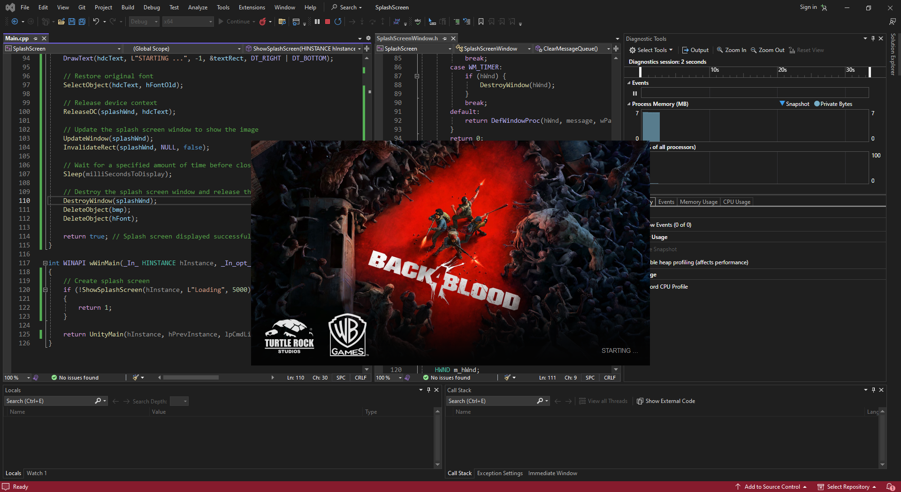

# UnitySplashScreen

> Splash Screen for unity3D

### Preview


## 📘 Using the code

* In the unity build settings, check Create Visual Studio Solution.
* Add an image with .bmp (bitmap) format to the "WindowsPlayer.rc" resource.
* Include "resource.h" in "PrecompiledHeader.h", If necessary, also include <CommCtrl.h>.
* Add the code above wWinMain(...) in Main.cpp
* Call ShowSplashScreen in wWinMain(...)

```cpp
int WINAPI wWinMain(_In_ HINSTANCE hInstance, _In_opt_ HINSTANCE hPrevInstance, _In_ LPWSTR lpCmdLine, _In_ int nShowCmd)
{
    // Create splash screen
    if (!ShowSplashScreen(hInstance, L"Loading", 5000))
    {
        return 1;
    }

    return UnityMain(hInstance, hPrevInstance, lpCmdLine, nShowCmd);
}
```

## 💻 Code
```cpp
static bool ShowSplashScreen(HINSTANCE hInstance, LPCWSTR lpWindowName, int milliSecondsToDisplay) {
    
    // Load the bitmap image for the splash screen
    HBITMAP bmp = (HBITMAP)::LoadImage(hInstance, MAKEINTRESOURCE(IDB_BITMAP1), IMAGE_BITMAP, 0, 0, LR_DEFAULTSIZE | SS_CENTERIMAGE);
    
    // Check if the bitmap creation failed
    if (!bmp)
    {
        return false;
    }

    RECT rct;
    GetWindowRect(GetDesktopWindow(), &rct);

    // Get information about the loaded bitmap
    BITMAP bmpInfo{ };
    GetObject(bmp, sizeof(BITMAP), &bmpInfo);

    // Gets the size of the loaded bitmap to the window size
    int nWidth = bmpInfo.bmWidth;
    int nHeight = bmpInfo.bmHeight;

    // Center the splash screen window on the screen
    int xPos = rct.left + (rct.right - rct.left) / 2 - (nWidth / 2);
    int yPos = rct.top + (rct.bottom - rct.top) / 2 - (nHeight / 2);

    // Create the splash screen window
    HWND splashWnd = CreateWindowEx(
        WS_EX_TOPMOST | WS_EX_TOOLWINDOW,
        WC_STATIC,
        lpWindowName,
        WS_VISIBLE | WS_POPUP | SS_BITMAP,
        xPos,
        yPos,
        nWidth, 
        nHeight,
        NULL, NULL, hInstance, NULL);
    
    // Check if the window creation failed
    if (!splashWnd)
    {
        return false;
    }

    // Set the bitmap image on the splash screen window
    ::SendMessage(splashWnd, STM_SETIMAGE, IMAGE_BITMAP, (LPARAM)bmp);

    // Create font for displaying text on splash screen
    HFONT hFont = CreateFont(
        16,                  // Font size
        0,                   // Character width
        0,                   // Orientation angle
        0,                   // Italic angle
        FW_NORMAL,           // Font weight
        FALSE,               // Italic
        FALSE,               // Underline
        FALSE,               // Strikethrough
        DEFAULT_CHARSET,     // Character set
        OUT_DEFAULT_PRECIS,  // Output precision
        CLIP_DEFAULT_PRECIS, // Clipping precision
        DEFAULT_QUALITY,     // Font quality
        DEFAULT_PITCH | FF_DONTCARE, // Font pitch
        L"Arial"             // Font name
    );
    
    // Get device context for text drawing
    HDC hdcText = GetDC(splashWnd);
    RECT textRect = { nWidth - 250, nHeight - 40, nWidth - 25, nHeight };

    // Select font into device context
    HFONT hFontOld = (HFONT)SelectObject(hdcText, hFont);

    // Set text color and background mode
    SetTextColor(hdcText, RGB(150, 150, 150));
    SetBkMode(hdcText, TRANSPARENT);

    // Draw text
    DrawText(hdcText, L"STARTING ...", -1, &textRect, DT_RIGHT | DT_BOTTOM);

    // Restore original font
    SelectObject(hdcText, hFontOld);

    // Release device context
    ReleaseDC(splashWnd, hdcText);

    // Update the splash screen window to show the image
    UpdateWindow(splashWnd);
    //InvalidateRect(splashWnd, NULL, false);

    // Wait for a specified amount of time before closing the splash screen
    Sleep(milliSecondsToDisplay);

    // Destroy the splash screen window and release the bitmap resource
    DestroyWindow(splashWnd);
    DeleteObject(bmp);
    DeleteObject(hFont);

    return true; // Splash screen displayed successfully
}
```

> [!WARNING]
> Code not tested in production.

## 🔴 Issues you may need to fix
[RC1015](https://learn.microsoft.com/en-us/cpp/error-messages/tool-errors/resource-compiler-fatal-error-rc1015?view=msvc-170) cannot open include file 'WinPlayerVersion.rc'.
 * Right click on "WindowsPlayer.rc" and view code
 * Change "WinPlayerVersion.rc" to "WindowsPlayerVersion.rc"

```
3 TEXTINCLUDE 
BEGIN
    "#include ""WindowsPlayerVersion.rc""\0"
END
```

```
#ifndef APSTUDIO_INVOKED
/////////////////////////////////////////////////////////////////////////////
//
// Generated from the TEXTINCLUDE 3 resource.
//
#include "WindowsPlayerVersion.rc"
/////////////////////////////////////////////////////////////////////////////
#endif    // not APSTUDIO_INVOKED
```
 * In other cases, check the name of the resource in your project folder

## :hash: Others
Old [Unity3DSplashScreen](https://github.com/xGalactico/Unity3DSplashScreen/tree/main) Project

### 😄 I hope it is useful for you!
